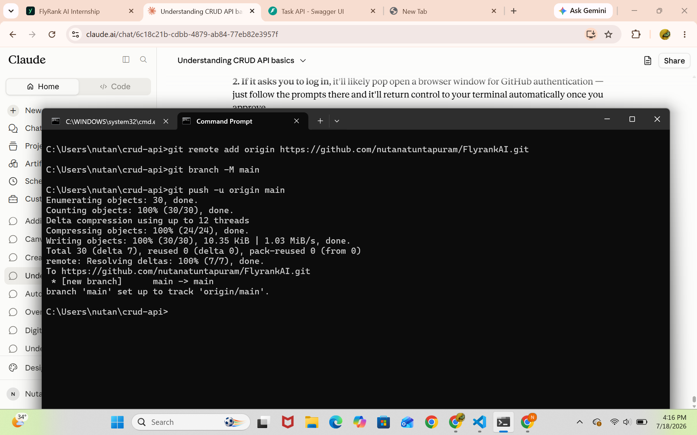

# Task API

A simple CRUD (Create, Read, Update, Delete) REST API for managing tasks, built with **Python** and **FastAPI**.

This project was built as a learning exercise to understand the fundamentals of building, testing, documenting, and publishing a backend API.

## Features

- Full CRUD support for tasks (create, list, get one, update, delete)
- Input validation with proper HTTP status codes (`200`, `201`, `400`, `404`, `204`)
- Interactive API documentation via Swagger UI (auto-generated by FastAPI)
- In-memory storage (no database required — data resets when the server restarts)

## Requirements

- Python 3.10+

## Installation & Running

Clone the repo, then run the following commands from the project folder:

```bash
python3 -m venv venv
venv\Scripts\activate          # Windows
# source venv/bin/activate     # macOS/Linux
pip install fastapi uvicorn
uvicorn main:app --reload --port 8000
```

The API will be running at: `http://localhost:8000`

Interactive Swagger docs are available at: `http://localhost:8000/docs`

## Endpoints

| Method | Endpoint         | Description                          | Success Status | Error Status |
|--------|------------------|---------------------------------------|-----------------|---------------|
| GET    | `/`              | Returns basic API info                | 200             | —             |
| GET    | `/health`        | Health check — confirms server is up  | 200             | —             |
| GET    | `/tasks`         | List all tasks                        | 200             | —             |
| GET    | `/tasks/{id}`    | Get a single task by id               | 200             | 404 if not found |
| POST   | `/tasks`         | Create a new task (`title` required)  | 201             | 400 if title missing/empty |
| PUT    | `/tasks/{id}`    | Update a task's `title` and/or `done` | 200             | 400 (bad body) / 404 (not found) |
| DELETE | `/tasks/{id}`    | Delete a task                         | 204 (no body)   | 404 if not found |

### Example task object

```json
{
  "id": 1,
  "title": "Buy groceries",
  "done": false
}
```

## Example Request

**Request:**
```bash
curl -i http://localhost:8000/tasks/1
```

**Response:**
```
HTTP/1.1 200 OK
date: Tue, 14 Jul 2026 17:02:18 GMT
server: uvicorn
content-length: 45
content-type: application/json

{"id":1,"title":"Buy groceries","done":false}
```

## Swagger UI

Interactive documentation, available once the server is running, at `/docs`:



## Project Structure

```
crud-api/
├── main.py           # All API routes and logic
├── requirements.txt  # Python dependencies (optional but recommended)
├── .gitignore
└── README.md
```

## Notes

- Data is stored in memory (a Python list), so it resets every time the server restarts. There is no persistent database in this version.
- Built as part of a step-by-step backend fundamentals exercise: hello world → routing → CRUD → validation → docs → publishing.
