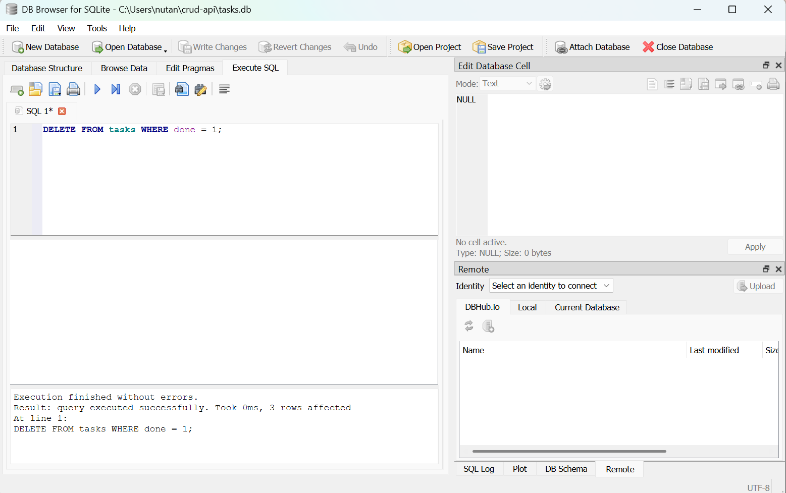

# Task API

A simple CRUD (Create, Read, Update, Delete) REST API for managing tasks, built with **Python** and **FastAPI**.

This project was built as a learning exercise to understand the fundamentals of building, testing, documenting, and publishing a backend API.

## Features

- Full CRUD support for tasks (create, list, get one, update, delete)
- Input validation with proper HTTP status codes (`200`, `201`, `400`, `404`, `204`)
- Interactive API documentation via Swagger UI (auto-generated by FastAPI)
- **Persistent storage with SQLite** — data survives server restarts

## Database

This project uses **SQLite** to store tasks.

**Why SQLite?**
- Requires no separate server or installation — it's just a single file
- Perfect for small projects, prototypes, and learning the fundamentals of SQL before moving to a larger database engine
- Built into Python's standard library (`sqlite3`), so no extra dependencies are needed to talk to it

**Where the data lives:**
- The database is a single file named `tasks.db`, created automatically in the project's root folder the first time the app runs
- It is **not** committed to this repository (see `.gitignore`) — every fresh clone starts with an empty database that gets seeded with 3 example tasks automatically on first run

**Schema:**

```sql
CREATE TABLE IF NOT EXISTS tasks (
    id INTEGER PRIMARY KEY AUTOINCREMENT,
    title TEXT NOT NULL,
    done BOOLEAN NOT NULL DEFAULT 0
);
```

**Example query used in this project** (fetching a single task by id):
```sql
SELECT * FROM tasks WHERE id = ?;
```

## Requirements

- Python 3.10+

## Installation & Running

Clone the repo, then run the following commands from the project folder:

```bash
python3 -m venv venv
venv\Scripts\activate          # Windows
# source venv/bin/activate     # macOS/Linux
pip install fastapi uvicorn
uvicorn main:app --reload --port 8000
```

The API will be running at: `http://localhost:8000`

Interactive Swagger docs are available at: `http://localhost:8000/docs`

## Endpoints

| Method | Endpoint         | Description                          | Success Status | Error Status |
|--------|------------------|---------------------------------------|-----------------|---------------|
| GET    | `/`              | Returns basic API info                | 200             | —             |
| GET    | `/health`        | Health check — confirms server is up  | 200             | —             |
| GET    | `/tasks`         | List all tasks                        | 200             | —             |
| GET    | `/tasks/{id}`    | Get a single task by id               | 200             | 404 if not found |
| POST   | `/tasks`         | Create a new task (`title` required)  | 201             | 400 if title missing/empty |
| PUT    | `/tasks/{id}`    | Update a task's `title` and/or `done` | 200             | 400 (bad body) / 404 (not found) |
| DELETE | `/tasks/{id}`    | Delete a task                         | 204 (no body)   | 404 if not found |

### Example task object

```json
{
  "id": 1,
  "title": "Buy groceries",
  "done": false
}
```

## Example Request

**Request:**
```bash
curl -i http://localhost:8000/tasks/1
```

**Response:**
```
HTTP/1.1 200 OK
date: Tue, 14 Jul 2026 17:02:18 GMT
server: uvicorn
content-length: 45
content-type: application/json

{"id":1,"title":"Buy groceries","done":false}
```

## Swagger UI

Interactive documentation, available once the server is running, at `/docs`:


## Project Structure

```
crud-api/
├── main.py           # All API routes and logic
├── requirements.txt  # Python dependencies (optional but recommended)
├── .gitignore
└── README.md
```

## Database Viewer

The database can be inspected directly using [DB Browser for SQLite](https://sqlitebrowser.org/), a free GUI tool for opening and querying `.db` files.



## Notes

- Data is stored in a local SQLite database (`tasks.db`), which persists across server restarts.
- Built as part of a step-by-step backend fundamentals exercise: hello world → routing → CRUD → validation → docs → publishing → SQL persistence.
